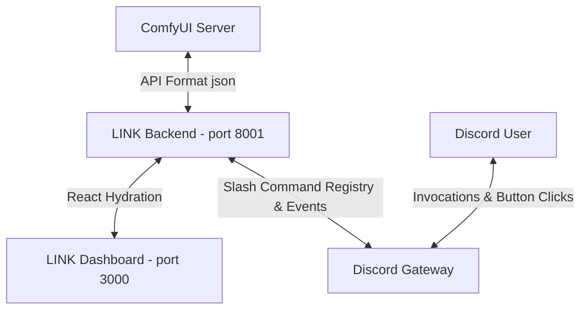
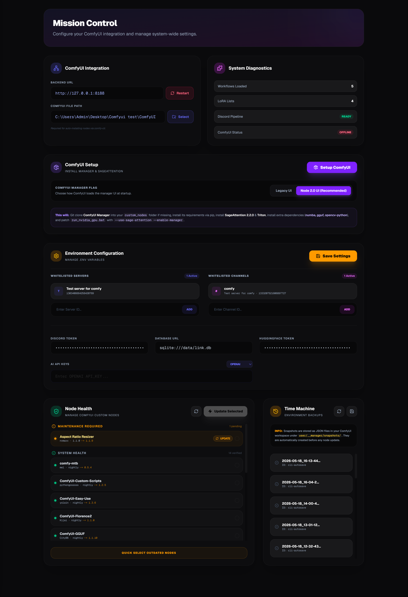
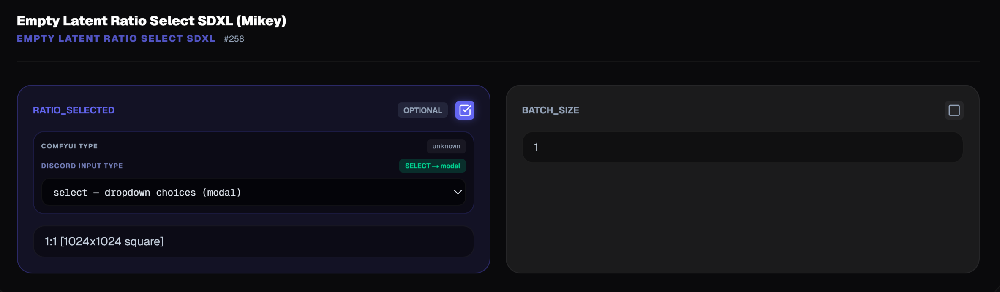
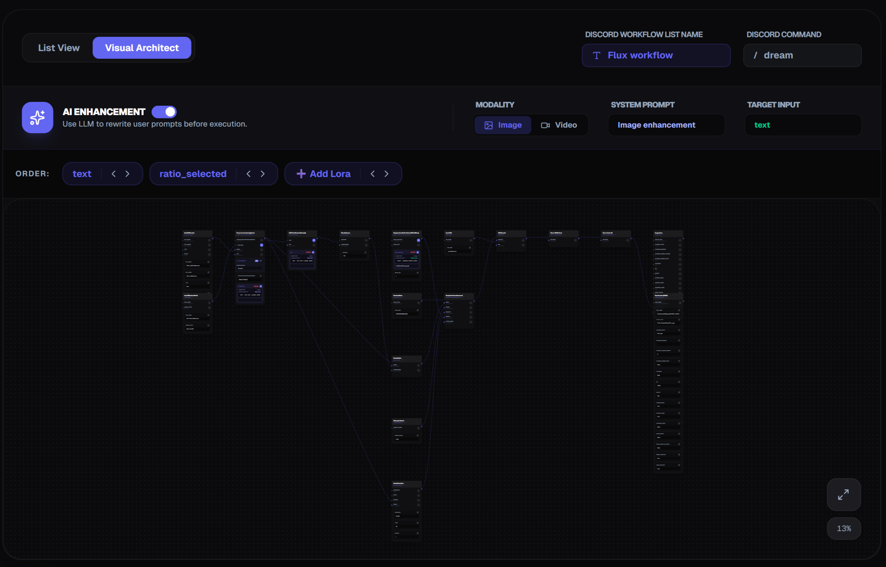
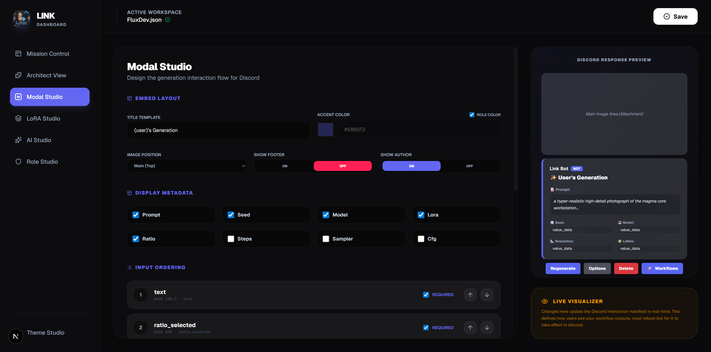
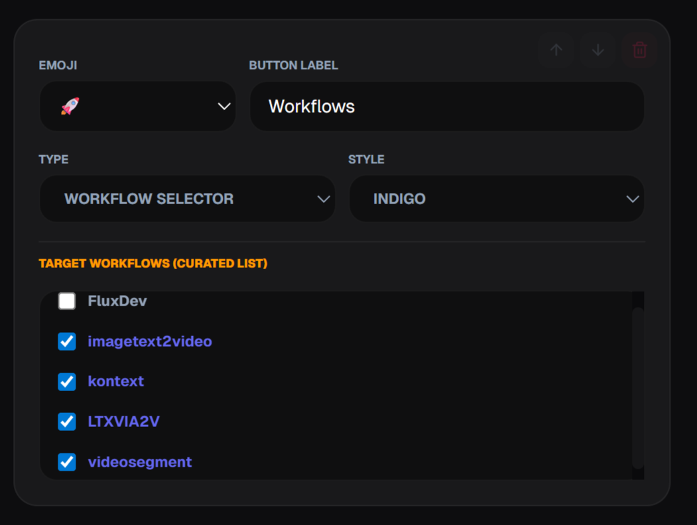
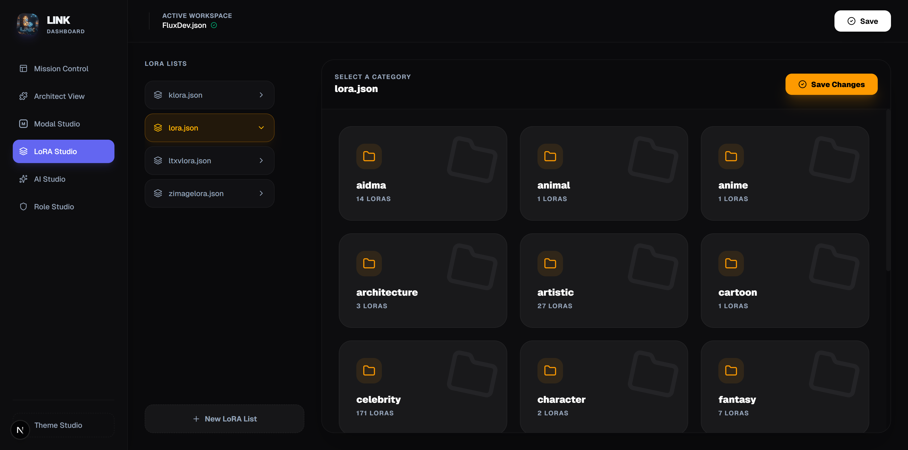
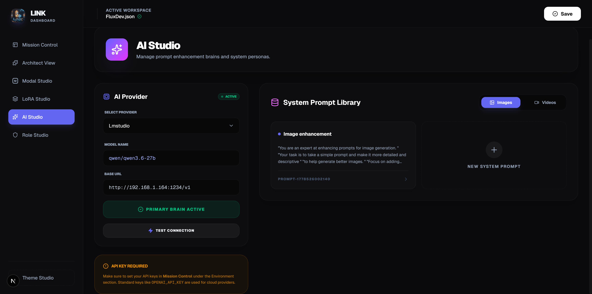
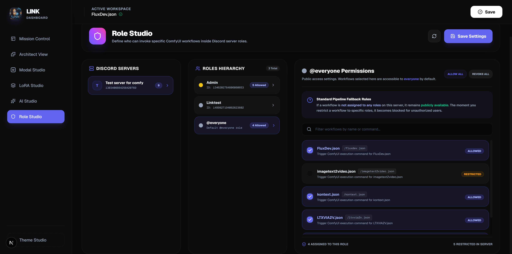

# 🌌 LINK (Link Architect) - Complete Operational & Configuration Manual

Welcome to the ultimate operational manual for **LINK**, the most powerful, premium suite for bridging complex **ComfyUI workflows** directly into high-fidelity, interactive **Discord slash commands**. 

LINK turns Comfyui API Workflows (node graphs) into accessible consumer applications, complete with automatic custom node installations, model downloading, AI-powered prompt enhancement, folder-structured LoRA directories, whitelisted channel boundaries, and role-based permissions—all managed through a gorgeous, glassmorphic dashboard.

---

## 🗂️ Table of Contents
1. [🌌 Core Architecture & Concept](#core-architecture)
2. [🎛️ Mission Control (System Integration & Environment)](#mission-control)
3. [📐 Architect View (Slash Command Exposing & Type Mapping)](#architect-view)
4. [🎭 Modal Studio (Interface Branding, Layouts, & Action Chaining)](#modal-studio)
5. [📁 LoRA Studio (safetensors Cataloging & Prompt Injection)](#lora-studio)
6. [🧠 AI Studio (LLM Personas & Live Prompt Enhancement Review)](#ai-studio)
7. [🔐 Role Studio (Granular Access Controls & Guild Security)](#role-studio)
8. [🪄 End-to-End Flow: From Raw JSON to Discord Masterpiece](#end-to-end-flow)

---

<a id="core-architecture"></a>
## 🌌 Core Architecture & Concept

LINK decouples the complex work of ComfyUI development from the user interaction. Instead of having users deal with noodle graphs or local VRAM limitations, LINK exposes specific, curated parameters to Discord slash commands.



### The Concept of a "Manifest"
Every workflow imported into LINK has an associated **Manifest**. The manifest describes:
- Which inputs on which ComfyUI nodes are exposed to Discord.
- What name, type, and default values those inputs have.
- The visual branding of the result embed (titles, layouts).
- Custom action buttons attached below the result that trigger subsequent workflows (workflow chaining).

---

<a id="mission-control"></a>
## 🎛️ Mission Control (System Integration & Environment)

**Mission Control** is the main dashboard landing panel. It is the central nervous system where system-wide integrations, directory locations, Discord scopes, credentials, and custom node systems are managed.



> [!NOTE]
> All settings edited in Mission Control are persisted instantly to local environment config and `.env` files.

### 1. ComfyUI Integration
* **Backend URL**: The absolute HTTP address where ComfyUI is running locally or remotely (default: `http://127.0.0.1:8188`).
* **ComfyUI File Path**: The absolute system folder path to your ComfyUI installation. Providing this is **mandatory** for LINK to auto-install missing nodes, read snapshots, and scan safetensors directories.

### 2. System Diagnostics
Displays live status badges showing:
- **Workflows Loaded**: Count of imported manifests.
- **LoRA Lists**: Count of indexed safetensors in your model catalog.
- **Discord Pipeline**: Shows `READY` when the gateway is active or `OFFLINE` if tokens are invalid.
- **ComfyUI Status**: Indicates if the ComfyUI API is reachable.

### 3. Auto-Configurator & Setup
Under the **ComfyUI Setup** sub-panel, administrators can execute deep environment configurations automatically:
- **SageAttention Integration**: Click "Setup ComfyUI" to automatically clone the ComfyUI Manager repository, install system requirements via pip, build and configure **SageAttention 2.2.0** and Triton, install high-performance dependencies (numba, gguf, opencv-python), and patch `run_nvidia_gpu.bat` with high-performance execution flags:
  ```bash
  --use-sage-attention --enable-manager
  ```
- **Manager Mode Toggle**: Choose between **Legacy UI** or the new high-performance **Node 2.0 UI** for ComfyUI.

### 4. Discord Whitelist Scopes
Configure boundaries for your bot:
- **Whitelisted Servers (Guilds)**: Specify which Discord Servers the bot is active in.
- **Whitelisted Channels**: Specify target channels where generation is allowed. Commands invoked outside whitelisted channels will receive an automated redirect notification.

### 5. Custom Node Health & Backups
LINK provides a full, visual package manager for your ComfyUI environment:
- **Update Selected**: Update out-of-date custom nodes directly from the panel. LINK pulls the latest git repositories, handles dependency resolution, and restarts ComfyUI in the background.
- **Environment Backups**: Displays local ComfyUI snapshot files created under `user/__manager/snapshots/`. If a node update breaks compatibility, restore a historical snapshot with a single click.

---

<a id="architect-view"></a>
## 📐 Architect View (Slash Command Exposing & Type Mapping)

The **Architect View** is where ComfyUI JSON graphs are transformed into human-friendly commands.


### Import Workflow (API) 
Import your own Comfyui Workflow API .json file, if you have a workflow you wish to use in discord, in comfyui you would save api workflow from comfyui, select and import here.  (does not support full workflows that comfyui uses, must be API version).

### List View vs Graph View
While ComfyUI displays graphs as complex wire webs, the Architect View maps them into an elegant **List View**. Nodes are presented as discrete cards, categorized logically (e.g., KSamplers, Loaders, Text Encoders, Image Saves). 

### Discord List name and command
At the top of any workflow you will have 2 fields, First is the Workflow list name when you bridge it or create a Custom button in the visual editor this can be named or brief description, 2nd is the /command name exposed in discord for users to use directly.

### Exposable Input Types
Every node card lists the internal inputs that the node requires.
1. Click the **Checkmark box** next to any input field to expose it.
2. Once exposed, this input is added as a parameter in the Discord slash command (e.g. `/workflow_name positive_prompt: "..."`).
3. Required vs Optional, if you specify required this is a required field to provide to make the workflow process, text input, resolution, etc, if the required input is needed in comfy best practice is use required here, Optional is if it is optional to make it work, optional can be like resolution if you always want the workflow to be set to a certain resoltion. but give user an option to change if they dont specify it and leave it blank whatever was set in the workflow will apply.



LINK supports advanced parameter mapping:
- **Text (Free text / Prompt)**: Perfect for text prompts. If marked as dynamic, clicking custom buttons in Discord will launch an input modal asking for prompt variations.
- **Select (Dropdown)**: Map input to a preset array of choices. Useful for aspect ratios, resolutions, sampler names, or base models.
- **Image/Video/Audio Upload**: Prompts the Discord user to attach a media file. LINK receives the attachment, uploads it securely to the ComfyUI workspace, and feeds it directly into `LoadImage`, `LoadVideo`, or `LoadAudio` nodes.

### Visual Architect

Link has a Visual Achitect mapping:
- **Node Maps**: Shows a interpetation of what the nodes look like closely in comfyui, you can make changes with in this by dragging and droping wires, though does not have add node or remove node options, does pull actively in drop downs and other options that are live with in those nodes. 



### AI Enhancement 

Link allows AI enhancement on images and Video workflows if setup, you will need to make sure these are setup prior to selecting on workflow, you must specify which AI enhancement to use, if its setup for Image or Video and which system prompt you want to choose. 

---

<a id="modal-studio"></a>
## 🎭 Modal Studio (Interface Branding, Layouts, & Action Chaining)

The **Modal Studio** defines the aesthetic experience of the Discord generation result. Rather than returning a raw file, LINK wraps generations in stunning, branded embeds.



### 1. Branding Embed Layouts
* **Embed Color**: A HEX code color bar rendered on the left of the Discord message.
    - Role Color: will use the color specified by roles in discord server for users.
* **Title Template**: The display user name + Generation (this is customizeable reply)
* **Layout Structure**: Toggle the generated file display position:
  - **Top**: Displays the generated image prominently at the top of the embed.
  - **Bottom**: Places the media beneath metadata boxes.
  - **Footer**: This is generation data from comfyui
  - **Show Author**: This is user generation you can turn on or off.
  
> [!WARNING]
> **Video/Audio Workflows**: For all video-generation workflows (e.g., LTX-Video, Hunyuan3D, AnimateDiff), the Image Position **MUST be set to Top Only** to ensure Discord's video player parses and executes the inline MP4 wrapper correctly.

### 2. Technical Metadata Toggles
Toggle checkmarks to expose generation statistics in the footer block

### 3. Custom Buttons & Workflow Chaining



The ultimate power of LINK lies in **Workflow Chaining**.
By attaching custom button components under the generated media, you can pass output assets directly into other workflows:
1. Click **Add Button** in the buttons array.
2. Select an emoji and standard label (e.g. `🎥 Animate Image`).
3. Set the **Target Workflow** (e.g., `LTXVIA2V.json`).
4. **Asset Propagation**: LINK will automatically grab the generated output image from the current run, pass it as the `Image Upload` input of the target animation workflow, and run the pipeline seamlessly, if any other parameters are needed a new response will pop up in discord for those.
5. In discord user will be prompted with a modal to specify which workflow to send the output from previous generation to which workflow.
6. Regenerate, Options, Delete buttons are standard buttons and will be produced automatically on each workflow imported.

---

<a id="lora-studio"></a>
## 📁 LoRA Studio (safetensors Cataloging & Prompt Injection)

The **LoRA Studio** provides a file-first model management library that integrates directly with positive text encoders.

### 1. Folder-Based Directory Mapping
LoRAs can be organized into folder categories (e.g. `Styles`, `Characters`, `Clothing`, `Poses`). LINK scans the `models/loras` directory inside ComfyUI and displays folders visually as glowing categories.



### 2. Lora Catagory and Trigger Words
When you click **Add LoRA** and select a `.safetensors` file:
- Speicfy weight, Description and any Trigger prompts needed for it to work. 
- URL, if you have a specific URL from which you downloaded it.
- (future feature will auto check your URL posted if there is any new versions and allows you to download from the dashboard)

### 3. Dynamic Prompt Injection
When a user selects a LoRA from the dropdown, LINK automatically appends the associated trigger words and applies precise weights when the lora node is used and specified in workflow / architect view.

---


<a id="ai-studio"></a>
## 🧠 AI Studio (LLM Personas & Live Prompt Enhancement Review)

The **AI Studio** configures LLM integrations to turn simple user prompts into highly-detailed descriptive prompts.



### 1. Multi-Provider API Configuration
Configure cloud or local LLM engines in Mission Control or the provider selection grid:
- **Cloud Providers**: OpenAI (GPT-4o), Anthropic (Claude 3.5 Sonnet), Google Gemini (Gemini 1.5 Pro), Grok (xAI).
- **Local Providers**: Ollama, LM Studio, vLLM (using local LLMs like Llama 3 or Mistral).

### 2. System Prompt Personas
Define specialized system guidelines categorized by target media:
- **Image Personas**: Instructs the LLM to expand prompts with details about lens type, volumetric lighting, photographic composition, and mood.
- **Video Personas**: Instructs the LLM to expand prompts with cinematic terms, camera pans, dollies, shutter speed, frame rates, and temporal physics.
- **Multiple Prompts**: you can have various prompts for various workflows, you can copy previous prompts and edit or create new ones as you go. Each workflow can have their own personal prompt and if chosen in role. 

### 3. Interactive Prompt Review Flow
When AI enhancement is enabled on a workflow a modal will pop up after you enter your prompt, before the generation starts. This allows you to review and edit the prompt before it is sent to ComfyUI. 
1. The user inputs `/generate prompt: "a cat running"`.
2. A enhancement modal pop up asking if user wants to enhance prompt. 
3. The bot intercepts the prompt and sends it to the configured LLM engine.
4. The LLM expands the prompt based on the active **AI Persona**.
5. **Discord Prompt Modal**: Instead of running immediately, the bot displays an interactive Discord modal window with the enhanced prompt. The user can review, edit, or adjust the prompt before clicking **Confirm Generation**.

---

<a id="role-studio"></a>
## 🔐 Role Studio (Granular Access Controls & Guild Security)

The **Role Studio** controls security by restricting workflows to specific Discord Roles.



### 1. Live Gateway Sync (Zero Reboot)
All configurations defined in the Role Studio are saved instantly to [permissions.json](./data/permissions.json) and read dynamically at command invocation runtime. **No Discord bot reboot is required** for permissions settings to take effect.

### 2. Dynamic Hierarchy Rendering
- Select a whitelisted Discord Server from the left column.
- The middle column fetches the roles list directly from the live Discord gateway, sorted descending matching Discord's visual hierarchy.
- Each role button displays its color badge matching the color set by server administrators in Discord.

### 3. Smart Permissions Fallback Rules
LINK uses an intuitive security fallback system:

> [!IMPORTANT]
> **Rule 1: Public by Default**
> If a workflow is **not assigned to any roles** on a server, it remains **publicly accessible** to all users by default.
>
> **Rule 2: Role Restriction**
> The moment you assign a workflow to *at least one role* on a server, it becomes locked. Only users possessing that role (or a structurally higher administrative role) can invoke it.
>
> **Rule 3: Everyone Bypass**
> Assigning a workflow to the `@everyone` role makes the command public again.

---
---


<a id="end-to-end-flow"></a>
## 🪄 End-to-End Flow: From Raw JSON to Discord Masterpiece

Follow this step-by-step tutorial to import a workflow, configure it, add prompt enhancement, and secure it.

### Step 1: Export API Format from ComfyUI
1. Open your workflow in ComfyUI.
2. In ComfyUI settings, ensure **"Enable Dev mode"** is checked.
3. In the control panel, click **"Save (API Format)"** to download your JSON file.

### Step 2: Import into Architect View
1. Open the LINK Dashboard (`http://localhost:3000`) and switch to the **Architect View** tab.
2. Click **"Import Workflow"**, select your JSON, and name it `imgengen`.
3. Locate the `CLIPTextEncode` positive node, click the **checkbox** to expose it, set the input type to `Text`, and name it `Prompt`.
4. Select any other options needed for workflow to run.
5. Click **"Save"** at the top right to write the settings to disk.

### Step 3: Brand the Embed in Modal Studio
1. Open **Modal Studio**.
2. Set the Settings and options
5. Click **"Save"**.

### Step 4: Configure AI Enhancement in AI Studio
1. Switch to **AI Studio**.
2. Select your AI provider (e.g. `Gemini` or `OpenAI`).
3. Set the model name to `gemini-1.5-pro` or `gpt-4o`.
4. Under the System Prompt Library, select the default image persona.
5. Test the connection. AI enhancement is now ready!

### Step 5: Secure the Workflow in Role Studio
1. Switch to **Role Studio**.
2. Select your server `Test server for comfy`.
3. Select the `@everyone` role and click **Revoke All** to restrict public access.
4. Select the `Role Name` role and click the checkbox next to `imgengen` to checkmark it as **Allowed**.
5. Click **Save Settings** at the top right.

### Step 6: Test Live in Discord
1. Go to your Discord server and type `/imgengen`.
2. The bot will prompt for the required parameter `prompt:` and any other parameters required.
3. Enter your prompt. The LLM will prompt to enhance or not. pop up an interactive review window, and after you click confirm, the workflow will run on your ComfyUI backend.
4. The generation will return inside a premium indigo embed with a regenerate, options, delete and any custom buttons you set up in modal studio!
