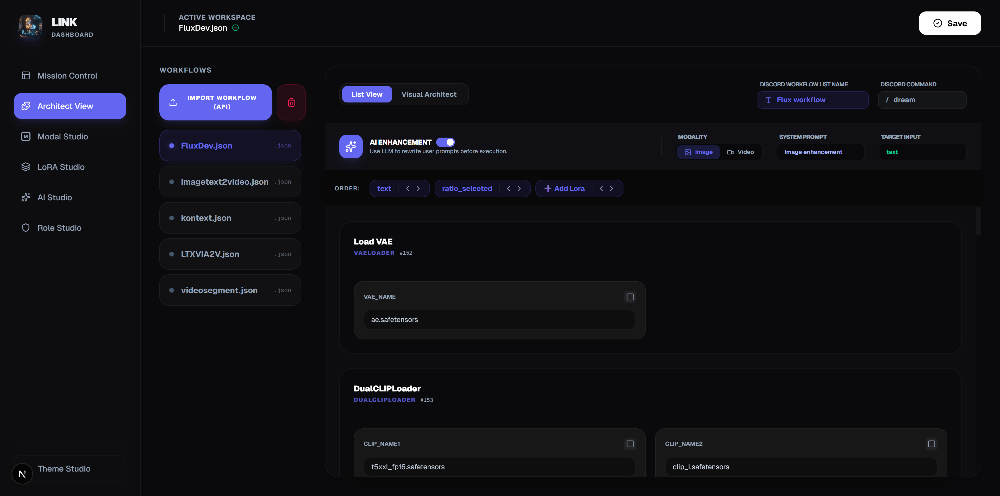
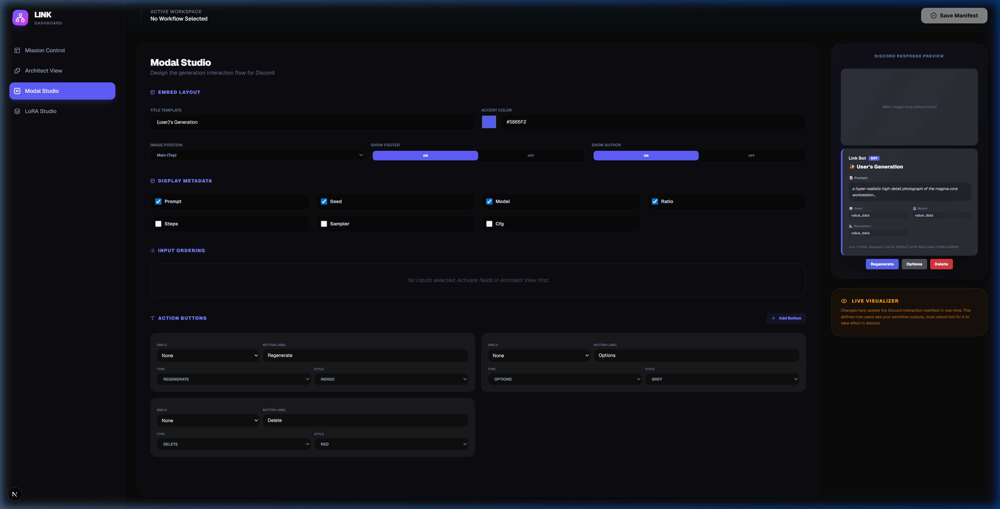
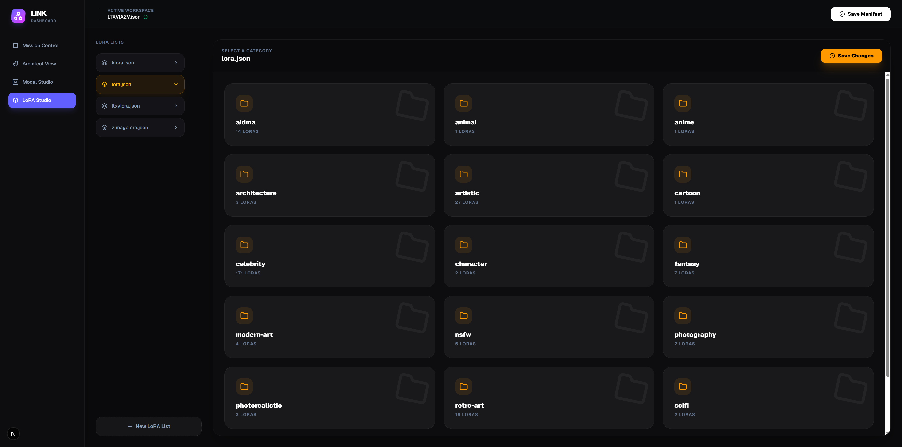
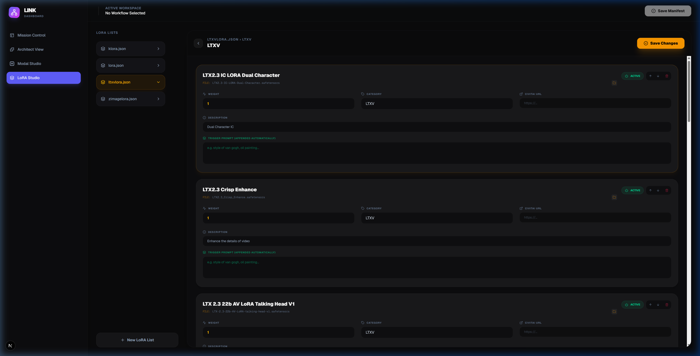

# 🔗 LINK: The Ultimate Discord-ComfyUI Bridge


### **Break the barrier.** 

**LINK** is the definitive command center for Generative AI. It’s not just a bridge—it's a professional-grade orchestration suite that elevates ComfyUI into a seamless Discord experience. Architect your workflows, and manage massive model libraries with surgical precision. No manual coding. No compromises. Just pure performance. 

> [!TIP]
> **If you can dream it in Comfy, you can dominate it in Discord.**

---

### 🚀 Core Capabilities
- **Mission Control**: Configure your ComfyUI integration and manage system-wide settings.
- **System Diagnostics**: Shows current workflows, lora lists, and if discords pipeline is healthy. 
- **Node Health**: Monitors and checks for updates to installed nodes, and allows for selective updates.
- **Time Machine**: Captures snapshots for comfyui workspace, when nodes are updated and or changed, allows for roll back to a previous stable node install. 


### 🎨 Visual Architect
Turn complex ComfyUI graphs into simple Discord commands.
- **Node-to-Input Mapping**: Visually select which ComfyUI inputs (prompts, seeds, sliders) should be exposed to Discord users.
- **Automatic Workflow Node Installation**: LINK automatically installs missing nodes for your workflows when you upload them to the dashboard.
- **Automatic Type Inference**: LINK intelligently detects if an input is text, a number, or an image upload.
- **Real-time Synchronization**: Changes made in the Architect are instantly reflected in the Discord bot's slash commands.

### 🎭 Modal Studio
Design the perfect user experience for your generation results.
- **Visual Branding**: Customize embed colors, titles, and metadata layouts.
- **Dynamic Action Buttons**: Add custom buttons (Regenerate, Upscale, Video-ify) that trigger chained workflows.
- **Dynamic Modal Selection**: Allows users to select a different workflow to run after a successful generation. 
- **Asset Propagation**: Automatically pass generated images or videos from one workflow to the next.

### 📁 LoRA Studio
A professional-grade management system for your model library.
- **Folder-Based Organization**: Group LoRAs into custom categories (Styles, Characters, Poser, etc.).
- **File-First Workflow**: Click "Add LoRA", pick your `.safetensors` file, and LINK handles the rest—extracting names and extensions automatically.
- **Dynamic Prompt Injection**: Automatically append trigger words and apply precise weights to your positive prompts based on your selected LoRA.

### 🧠 AI Studio

- **Global AI Configuration**: Configure and manage multiple LLM providers (Gemini, OpenAI, Ollama, etc.) and their API keys.
- **System Prompt Library**: A centralized repository for your system prompts, categorized by Image and Video.
- **Prompt Enhancement**: Use LLMs to enhance your ComfyUI prompts, making them more effective and detailed.
- **Interactive Enhancement**: Users can review and edit enhanced prompts in the Discord bot before generation.

---

## 🖼️ Interface Showcase

| Visual Architect | Modal Studio |
| :---: | :---: |
|  |  |
| **LoRA Category Folders** | **LoRA Detail Management** |
|  |  |

---

## 🛠️ Quick Start

> [!IMPORTANT]
> New to LINK? Follow our **[Getting Started Guide](./GETTING_STARTED.md)** for a full step-by-step walkthrough.
> To see what we're building next, check out our **[Coming Soon / Roadmap](./ROADMAP.md)**.

### 1. Requirements
- **Latest Stable Release of ComfyUI** - Download from [ComfyUI's GitHub](https://github.com/comfyanonymous/ComfyUI/releases).
- **ComfyUI** running workflows working.
- **Node.js 20+** and **Python 3.10+**.

### 2. Installation
```bash
# Clone the repository
git clone https://github.com/nvmax/Link.git
cd LINK

# Install dependencies
npm install
cd dashboard && npm install && cd ..
pip install -r requirements.txt
```

### 3. Configuration
Create a `.env` file in the root directory:
```env
DISCORD_TOKEN=your_token_here
COMFY_URL=http://127.0.0.1:8188
DATABASE_URL=sqlite:///data/link.db
ALLOWED_GUILD_ID=your_server_id
ALLOWED_CHANNEL_ID=your_channel_id
```
Discord bot requirements:

- Must have Presence, server members, and message content intents enabled
- permissions to give it for install on your own 
  - Send Messages
  - Manage Messages
  - Embed Links
  - Attach Files

.env must be populated before running. This can be done by copying .env.example to .env and populating it with the appropriate values.
your discord bot must be setup and added to your discord server https://discord.com/developers/applications only settings that need to be populated are:
- bot token
- Server ID 
- Channel ID

### 4. Run the Suite

**Option A: The One-Click Way (Recommended for Windows)**
Simply double-click the **`launch.bat`** file in the project root. This will automatically open two separate terminal windows for you—one for the Dashboard and one for the Bot.

**Option B: The Manual Way**
If you prefer manual control, open **two terminal windows** and run:

**Terminal 1: The Dashboard**
```bash
npm run dashboard
```

**Terminal 2: The Bot**
```bash
npm run bot
```

---

---

## 📂 Project Anatomy

> [!NOTE]
> LINK follows a modular architecture where the Dashboard serves as the "Control Plane" and the Bot serves as the "Execution Engine".

- **`src/bot/`**: High-performance Discord integration using `discord.py`.
- **`src/workflows/`**: The brain of the operation—stores your YAML manifests and LoRA registries.
- **`dashboard/`**: A modern Next.js/Tailwind application for visual workflow architecting.
- **`src/api/`**: Robust WebSocket bridge for real-time communication with ComfyUI.

---

## 🤝 Contributing & Community
We love contributions! If you want to help make LINK even better, please check out our **[Contributing Guide](./CONTRIBUTING.md)** for rules and ways to get involved.

---

## 🔒 Security & License
- **Access Control**: Use `ALLOWED_GUILD_ID` to lock your bot to specific servers.
- **Local First**: Your prompts, models, and workflows stay on your hardware. No cloud tracking.
- **License**: LINK is free for **personal, non-commercial use**. For commercial licensing, please see the **[LICENSE](./LICENSE)** or contact [JerrodLinderman@gmail.com](mailto:JerrodLinderman@gmail.com).

---

### ☕ Support the Developer
If you find **LINK** useful and want to help support its continued development, consider buying the dev a coffee!

[](https://paypal.me/nvmaxx)

*Built with ❤️ for the ComfyUI Community.*
